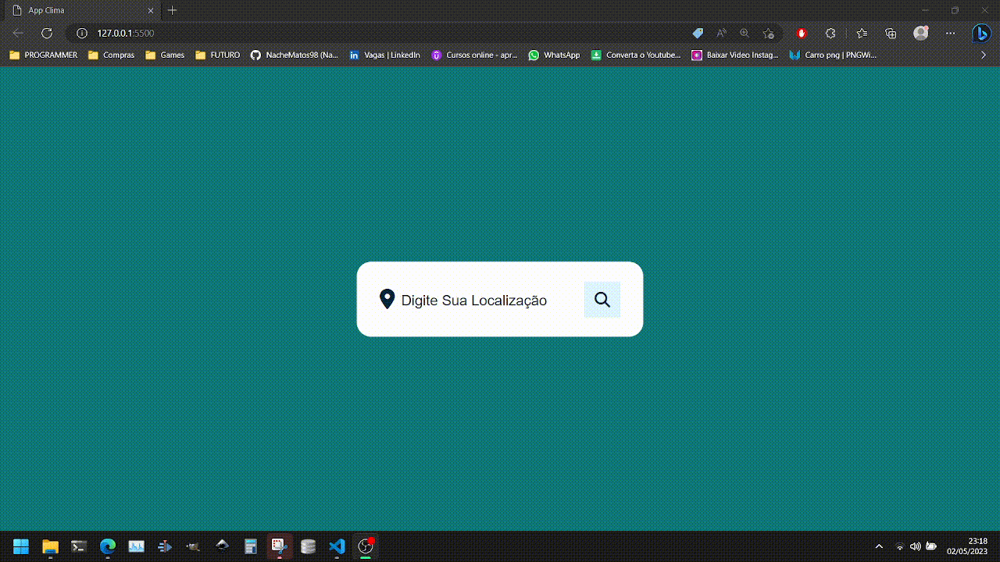

# Projeto - Clima APP

Uma aplicação feita para consultar a situação do clima em cidades pelo mundo, feito com JavaScript puro, HTML, CSS e com a API OpenWeather.

- O projeto
- Página assim que é aberta.

 

- Cidade consultada

 

- Demonstração

 

## 💻 Tecnologias utilizadas
As seguintes ferramentas foram utilizadas na construção do projeto:
- [Javascript](https://developer.mozilla.org/en-US/docs/Web/JavaScript) | [HTML](https://developer.mozilla.org/en-US/docs/Web/HTML) | [CSS](https://developer.mozilla.org/en-US/docs/Web/CSS)
- [API-OpenWeather](https://developer.mozilla.org/en-US/docs/Web/JavaScript](https://openweathermap.org/api)
